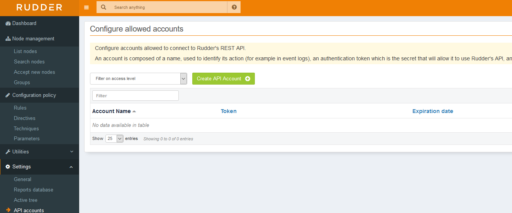
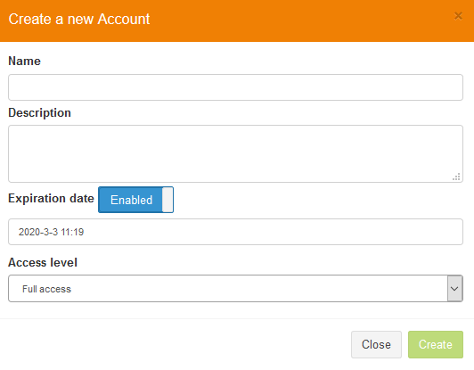

### The API

API allows you to query and modify every aspect of your Rudder environment.

You find it on the left side bar, and the users are not bound to API access. For example if you have a user which can access the UI, it is not going to be able to access the API by default.




You need to create a new API user with a specific access level.



We will user python to demonstrate some functionality. 

You can visit the [API Documentation](https://docs.rudder.io/api/) for full details. Make sure you visit the appropriate doc based on your Rudder version.

In order to query the rules we can use this small script.

``` python
import requests
requests.get(url = "https://<rudderhost>/rudder/api/latest/rules", headers = {"X-API-Token":"yaTXYTktka52Vy4ljlqlPkgCJoDU5Dq7"},verify = False)
```

The response would be something like this.

``` bash
{"action":"listRules","result":"success","data":{"rules":[{"id":"32377fd7-02fd-43d0-aab7-28460a91347b","displayName":"Global configuration for all nodes","shortDescription":"","longDescription":"This Rule was created automatically when Rudder was installed. It can be used to target Directives to all nodes (including the Rudder root server itself), or deleted if you would rather create your own set of Rules (it will never be created again).","directives":[],"targets":["special:all"],"enabled":true,"system":false,"tags":[]}]}}
```