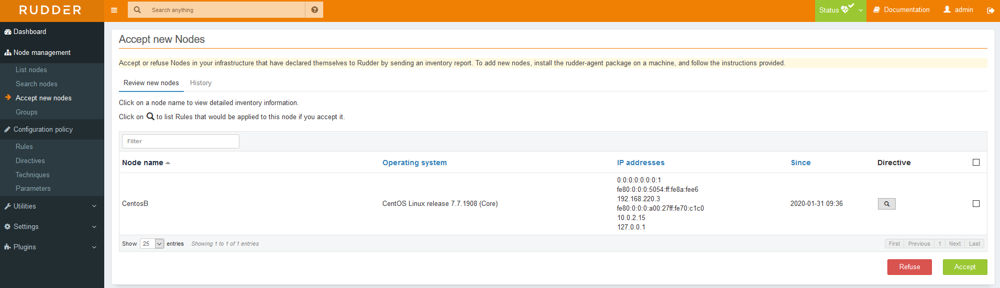

### Installing the agent

This secrtion provides you with the necessary steps to setup an agent.
The agent is already installed when you install the **root-server** so you dont need to perform these steps on that server.

We are going to create a new file **/etc/yum.repos.d/rudder.repo**.

The content of this file will be the following.

``` bash
[Rudder_5.0]
name=Rudder 5.0
baseurl=http://repository.rudder.io/rpm/5.0/RHEL_7/
gpgcheck=1
gpgkey=https://repository.rudder.io/rpm/rudder_rpm_key.pub
```

After saving this file we would like to install the package.

``` bash
yum install rudder-agent -y
```

Once the install is complete we need to configure our agent so that it knows where the root server is.

``` bash
echo '<root-server>' > /var/rudder/cfengine-community/policy_server.dat
```
Now we need to start the agent.

``` bash
rudder agent start
```

It takes a couple of minutes for the agent to communicate with the root-server, but onces its done we can check on the dashboard for the pending agent.
On the dasboard you should see the new agent under the **Accept new nodes** tab.




You need to select the node and **Accept** it, after confirmation you will find the new node under the **List Nodes**.
Once accepted we can see the new node, currently the policies are getting applied.


There are three useful commands which you need to know in order to work properly with agents.

The following command forces the agent to send their inventory to the root server.

``` bash
rudder agent inventory
```

The following command will force the agent to run all it's tasks.

``` bash
rudder agent run
```

In order to get details about our agent you need to issue the following command.

``` bash
rudder agent info
```

See you in the next one.