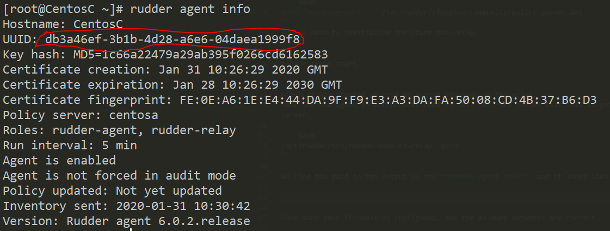
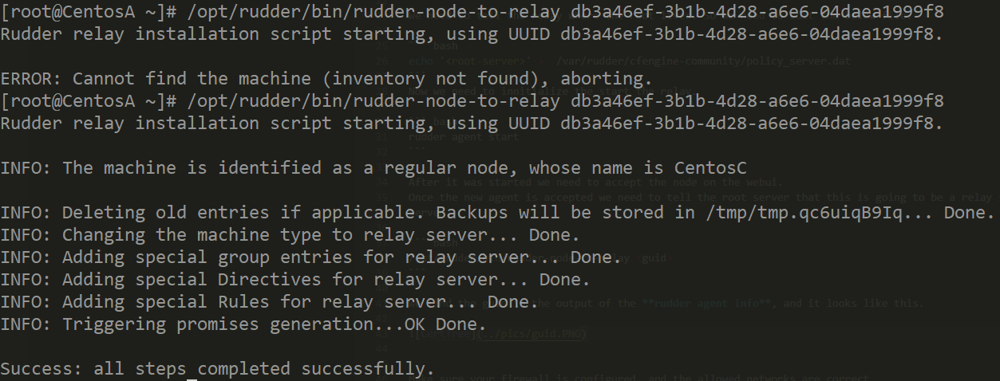
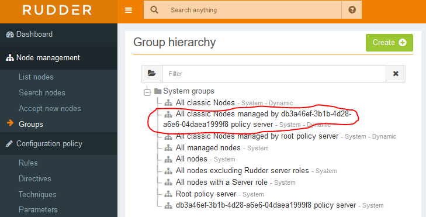

### Installing our relay server

You need to install the **scaleout** plugin for this to work.

Relay servers help you scale your Rudder infrastructure.

We are going to create a new file **/etc/yum.repos.d/rudder.repo**.

The content of this file will be the following.

``` bash
[Rudder_5.0]
name=Rudder 5.0
baseurl=http://repository.rudder.io/rpm/5.0/RHEL_7/
gpgcheck=1
gpgkey=https://repository.rudder.io/rpm/rudder_rpm_key.pub
```

After saving this file we would like to install the package.

``` bash
yum install rudder-server-relay -y
```

We need to tell the relay where the root lives. So we need to edit the below file.

``` bash
echo '<root-server>' >  /var/rudder/cfengine-community/policy_server.dat
```
Now we need to innitialize the start the relay.

``` bash
rudder agent start
```

After it was started we need to accept the node on the webui.
Once the new agent is accepted we need to tell the root server that this is going to be a relay server. We can do it by the following command issued on the root server.

``` bash
/opt/rudder/bin/rudder-node-to-relay <guid>
```

We find the guid in the output of the **rudder agent info**, and it looks like this.



Once the command was issued we should see something like this.



Once the initialization is complete we will see on the web UI, under the **Group** tab the following.



This means our policy server is ready for new agents to connect, all we need to do is to edit the **/var/rudder/cfengine-community/policy_server.dat** file on our agents and set our relay server's address.


