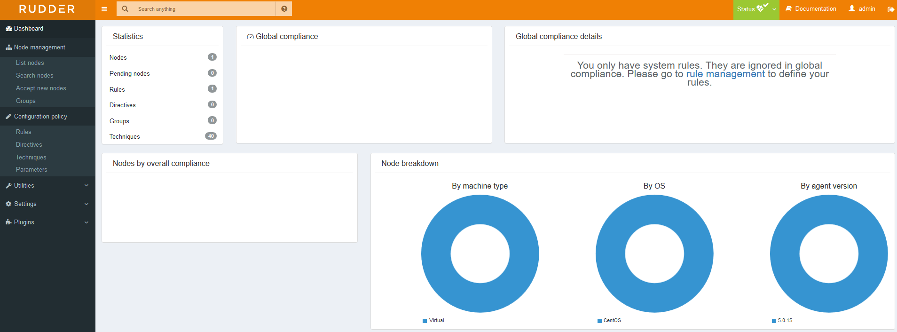

### Installing our root server

This secrtion provides you with the necessary steps to setup a root server.

You can either use the one line bootstrapper script to install the tool.

``` bash
curl https://repository.rudder.io/tools/rudder-setup | bash -s setup-server 5.0
```

Or create your own repository file under **/etc/yum.repos.d/rudder.repo**.

The content of this file will be the following.
 
``` bash
[Rudder_5.0]
name=Rudder 5.0
baseurl=http://repository.rudder.io/rpm/5.0/RHEL_7/
gpgcheck=1
gpgkey=https://repository.rudder.io/rpm/rudder_rpm_key.pub
```

After saving this file we would like to install the package.

``` bash
yum install rudder-server-root -y
```

The install takes some time so grab a coffe. 

Once the install is complete we either disable the firewall or allow the necessary port.

``` bash
# To disable
systemctl stop firewalld
# To allow the port
firewall-cmd --permanent --zone=public --add-port=443/tcp
```
Now we need to innitialize the server with the following command.

``` bash
/opt/rudder/bin/rudder-init
```

This will ask for the allowed network which can access the server, dont worry later you can manually modify it if you need to.

Once the init is complete you can login to the web UI!

``` bash
https://<hostname>/rudder
```

Make sure your firewall is configured, and the allowed networks are correct.

Here is how the dashboard looks.



See you in the next one.


