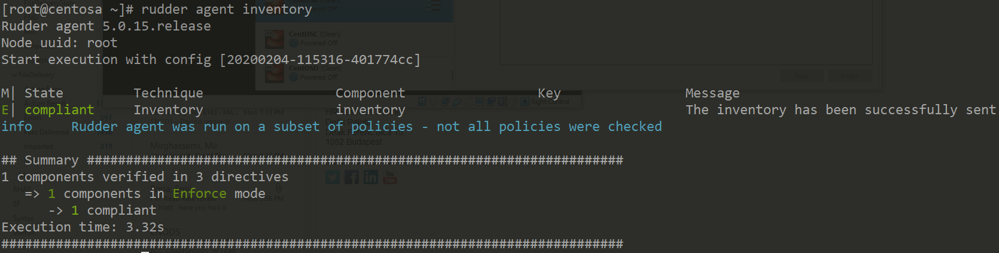
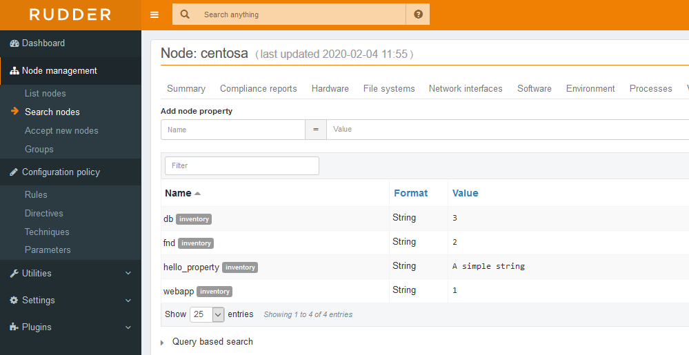

### Custom hooks

Rudder supports adding further information from your nodes as per **hooks** can be defined.

The scripts should be executable and produce a JSON output.

The location of these scritps are **/var/rudder/hooks.d**.

Let's create a small python script to demonstrate it under **/var/rudder/hooks.d/hello_py**

``` python
#!/bin/python
import json

print json.dumps(json.dumps({"webapp":1,"fnd":2,"db":3}))
```

Now we need to make this executable with the following command.

``` bash
chmod +x /var/rudder/hooks.d/hello_py
```

We can now re-run the inventory with the following command.

``` bash
rudder agent inventory
```

You whould see the following output.



Now if we check the web interface  we shoul see under the properties of the node the new properties.


